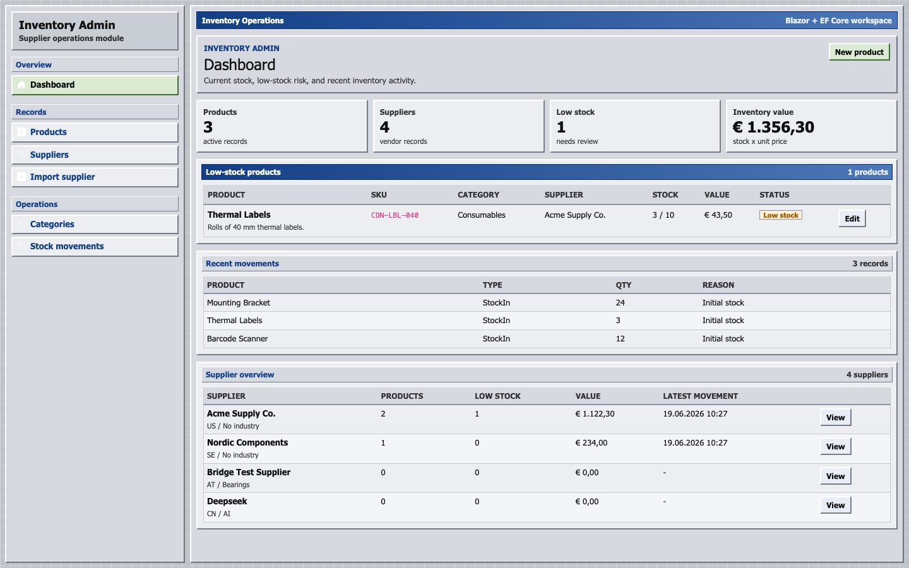
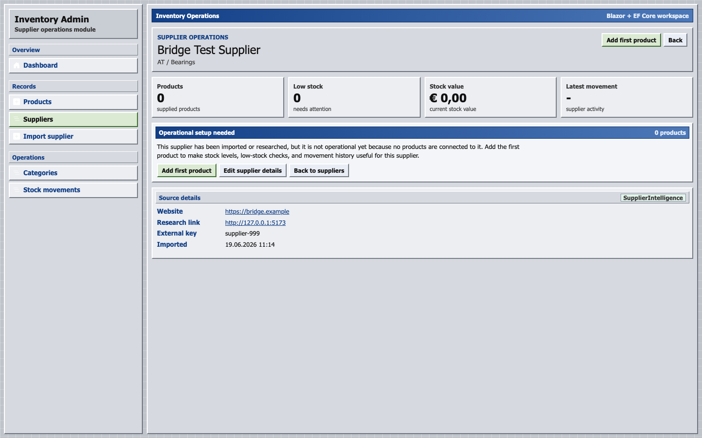
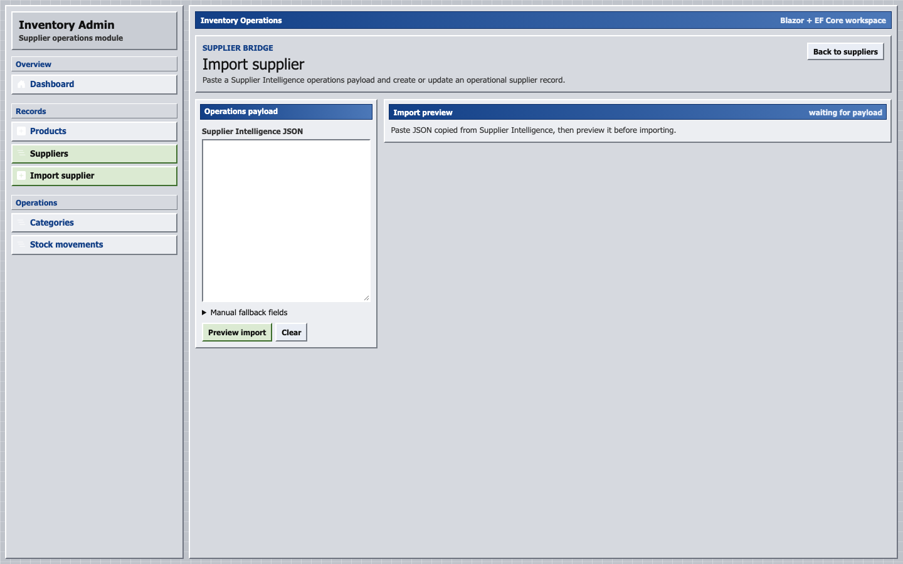

# Inventory Admin

Inventory Admin is a Blazor + EF Core learning project for managing supplier operations after supplier research is finished.

It connects to the Supplier Intelligence app through a manual JSON bridge: research a supplier there, copy the operations payload, import it here, then manage products, stock, low-stock checks, and supplier activity.


## Screenshots

### Dashboard



### Supplier Operations Detail



### Supplier Import Bridge



## What It Does

- Track suppliers, categories, products, and stock movements.
- Import researched suppliers from Supplier Intelligence using a copied JSON payload.
- Match imported suppliers by external key or by name and country.
- Show supplier operation detail pages with products, stock value, low-stock risk, and movement history.
- Guide newly imported suppliers through an operational setup flow.
- Add the first product directly from a supplier detail page.
- Preselect suppliers when creating products from supplier pages.
- Record quick stock-in movements from supplier detail pages.
- Record quick stock-out movements with negative stock prevention.
- Expose flat JSON API endpoints for dashboard, products, suppliers, imports, and operation summaries.

## Product Flow

```text
Supplier Intelligence research -> Copy for Operations -> Import supplier -> Add product -> Track stock -> Review supplier operations
```

The two apps stay separate on purpose:

- `Supplier Intelligence` answers: What is this supplier?
- `Inventory Admin` answers: What do we do with this supplier operationally?

## Tech Stack

| Layer | Technology |
| --- | --- |
| UI | Blazor Interactive Server |
| Backend | ASP.NET Core |
| Data | Entity Framework Core + SQLite |
| API | Minimal APIs + OpenAPI |
| Styling | Custom retro enterprise UI |
| Bridge | Manual JSON payload import |

## Local Setup

Start the app:

```bash
cd /Users/simon.jokanic/Desktop/c\#/03-blazor/inventory-admin
dotnet run --urls http://127.0.0.1:5199
```

Open:

```text
http://127.0.0.1:5199
```

The app uses a local SQLite database:

```text
inventory-admin.db
```

If the database does not exist, the app creates and seeds it automatically.

## Supplier Intelligence Bridge

In Supplier Intelligence:

1. Open a researched supplier.
2. Click `Copy for Operations`.
3. Copy the generated JSON payload.

In Inventory Admin:

1. Open `/suppliers/import`.
2. Paste the JSON payload.
3. Click `Preview import`.
4. Import or update the supplier.
5. Open the supplier detail page and add the first product.

The bridge is manual by design. It keeps this learning project simple and avoids a hard runtime dependency between two local apps.

## API Endpoints

| Endpoint | Purpose |
| --- | --- |
| `GET /api/dashboard` | Dashboard summary |
| `GET /api/products` | Product list |
| `GET /api/products/low-stock` | Low-stock products |
| `GET /api/suppliers` | Supplier list |
| `GET /api/suppliers/{id}` | Supplier detail |
| `POST /api/suppliers/import/preview` | Preview supplier import |
| `POST /api/suppliers/import` | Import or update suppliers |
| `GET /api/suppliers/{id}/operations-summary` | Supplier operation summary |

## Current Features

| Feature | Status |
| --- | --- |
| Blazor dashboard | Working |
| Product CRUD | Working |
| Supplier CRUD | Working |
| Category CRUD | Working |
| Stock movements | Working |
| Supplier import bridge | Working |
| Supplier detail pages | Working |
| Imported supplier onboarding | Working |
| Quick stock-in from supplier detail | Working |
| Quick stock-out from supplier detail | Working |
| Minimal API endpoints | Working |
| SQLite schema initialization | Working |

## C# Learning Goals

This project is useful for practicing:

- Blazor pages and Razor components
- Route parameters and query parameters
- `EditForm`, validation, and submit handlers
- `NavigationManager` redirects
- EF Core relationships and `Include`
- SQLite persistence
- Service-layer application logic
- Minimal API endpoint design
- DTOs instead of returning EF entities directly
- Additive local schema evolution

## Repository Notes

Do not commit local runtime data or build output:

- `bin/`
- `obj/`
- `*.db`
- `*.db-shm`
- `*.db-wal`

## Status

This is a learning/demo application, not a production inventory system.
